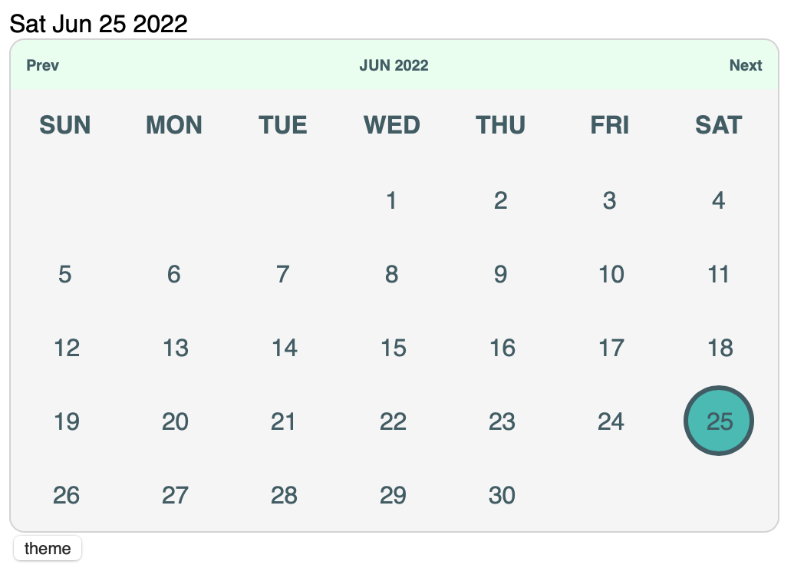

# calendar react component

### please refer to the package.json or prior to use install styled-components.

#

### this component has a theme switcher attached as well so you can play with colors and have fun with that. 

#

### calendar index.js obviously has all the meat to this component. it breaks down how we display hold values in arrays accourding to months and we map through the values as well as find the start day of the month. 

### there is a lot of room for growing on this bare bones component. if you feel i should change something up or add something please add issue fork it or clone it or whatever. 

#

## install package

        npm i styled-components

#

#### by William Wong
### https://github.com/billycwong19